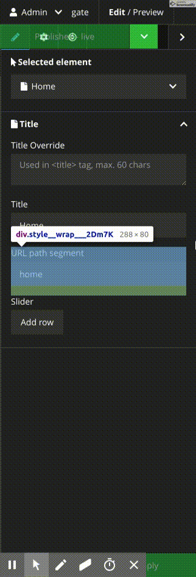

# RepeatableFields

Neos package for adding repeatables fields to neos-ui react

## Demo View



## Installation

```bash
composer require mireo91/repeatablefields
```

## Configuration

Create property with type `reapeatable`.

```YAML
  ...
  properties:
    repeatableProperty:
      type: repeatable
      ui:
        label: 'Repeatable Field Group'
        inspector:
          group: document
          editorOptions:
#            you can use data source to dynamically set editorOptions (example: {predefinedProperties: [...]})
#            dataSourceUri: ""
#            dataSourceIdentifier:
#            dataSourceDisableCaching: false
#            dataSourceAdditionalData:
#              apiKey: 'foo-bar-baz'
            buttonAddLabel: 'Add row' #default label
            max: 100 #default max
            min: 0   #default min
            indexKey: field0 # when set nested data are not available but you can get data like (.property("repeatableProperty.[value of field0].field1"))
            controls:  #default all set to true
              move: true
              remove: true
              add: true
              collapse: true
            # Automatically sort by on property
            # Should only used with numeric or string values
            # You can pass multiple properties
            sortBy:
              - property: field0
                direction: desc # asc or desc. If not set, it will be asc
              - property: field1
            # Allow to remove entries with predefined properties. Defaults to false
            allowRemovePredefinedProperties: true
            predefinedProperties:
              - label: Group label
                properties:
                  field0:
                    defaultValue: defalut value for index 0 field0
                    editorOptions:
                      readonly: true
                  field2:
                    defaultValue: defalut value for index 0 field1
              - properties:
                  field0:
                    defaultValue: defalut value for index 1 field0
              - properties:
                  field0:
                    defaultValue: defalut value for index 2 field0
#                ...
            # collapse view on load. controls.collapse must be true. defaults to false
            collapsed: true
            # Set preview (see "Preview with Reference Properties" section below)
            preview:
              text:  'ItemEval: item.field0'
              image: 'ItemEval: item.field1'
            properties:
              field0:
                # The order of the fields can be altered by setting position. It is the same logic as @position in Fusion
                # https://neos.readthedocs.io/en/stable/References/NeosFusionReference.html#neos-fusion-join
                position: 10
                editorOptions:
                  placeholder: 'default field editor'
              field1:
                type: 'Neos\Media\Domain\Model\ImageInterface' # type for property mapper
                label: 'Image field'
                # Hidden based on another property in the property list. node, parentNode and documentNode are also available
                hidden: 'ItemEval: !!item.field0 && documentNode.properties.pageProperty'
                editorOptions:
                  placeholder: 'placeholder test'
              field2:
                editor: 'Neos.Neos/Inspector/Editors/TextAreaEditor'
                label: 'Textarea editor'
                editorOptions:
                  placeholder: 'test placeholder 2'
```

## Preview with Reference Properties

When using `reference` type properties in a repeatable field, you can access the referenced node's properties in preview expressions. This allows you to display meaningful information like a person's name instead of just the node identifier.

### Example

```YAML
properties:
  teamMembers:
    type: repeatable
    ui:
      inspector:
        editorOptions:
          collapsed: true
          preview:
            text: 'ItemEval: item.person?.properties?.firstName + " " + item.person?.properties?.lastName'
          properties:
            person:
              type: reference
              label: 'Person'
              editorOptions:
                nodeTypes: ['My.Package:Document.Person']
```

### Available Properties

When a property is a `reference` type, the preview expression can access:

**Node properties** (nested under `properties` to avoid naming collisions):
- `item.propertyName.properties.firstName` - Any property defined on the referenced node
- `item.propertyName.properties.lastName`
- `item.propertyName.properties.position`
- etc.

**Metadata** (top-level):
- `item.propertyName.label` - The node's label
- `item.propertyName.identifier` - The node identifier (UUID)
- `item.propertyName.nodeType` - The node type name
- `item.propertyName.icon` - The node type icon

### Notes

- Reference resolution only applies to preview expressions (`preview.text` and `preview.image`)
- Editors continue to work with the original node identifier
- Only scalar properties (strings, numbers, booleans) are available; complex objects like images are not included

## Important notice

Please don't name any property (in the example `fieldN`) `_UUID_`, as this is used internaly to set a unique key to the items

## Nested

In fusion you can get data by path `q(node).property('repetableProperty').field1` so you get nested data form specific repeatable field

## Important changes between v1.x.x

Right now when you want to uprade to v2.x.x be aware that you may need to adjust some fusion because of better property mapping of object type fileds

## Issues

- early version
